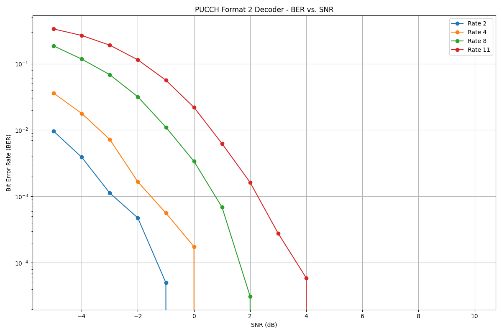

# PUCCH Format 2 Decoder

Реализация блочного декодера для PUCCH Format 2.



## Описание

Этот проект реализует симуляцию работы блочного декодера для PUCCH Format 2, который используется в LTE для передачи управляющей информации (UCI).  Проект включает в себя:

*   **Блочный кодер:** Кодирует входные данные с помощью порождающей матрицы.
*   **АБГШ канал:** Моделирует канал связи с аддитивным белым гауссовским шумом (АБГШ).
*   **Блочный декодер:** Декодирует принятые данные с использованием алгоритма полного перебора (brute-force) и прекомпиляции кодовых слов.
*   **Оркестратор:** Управляет процессом симуляции, задает параметры (SNR, rate), запускает симуляцию и собирает статистику (BER, время декодирования).
*   **Визуализация:** Скрипт на Python (`plot_results.py`) строит графики BER и времени декодирования в зависимости от SNR.

Реализованы коды со следующими размерностями: (20 × 2), (20 × 4), (20 × 6), (20 × 8), (20 × 11).

## Требования

*   Компилятор C++ (с поддержкой C++11 или C++20, рекомендуется C++20)
*   CMake (>= 3.15)
*   Python 3
*   Библиотеки Python: `numpy`, `matplotlib`

## Сборка проекта

1.  **Клонируйте репозиторий:**

    ```bash
    git clone https://github.com/vladimir-ponomarenko/YadroTestPucchDecoder.git
    cd <имя директории>
    ```

2.  **Создайте директорию сборки:**

    ```bash
    mkdir build
    cd build
    ```

3.  **Установите количество потоков для OMP:**

    ```bash
    export OMP_NUM_THREADS=<количество потоков>
    ```

3.  **Сгенерируйте файлы сборки с помощью CMake:**

    ```bash
    cmake ..
    ```

4.  **Соберите проект:**

    ```bash
    make
    ```

5. **Каталог `data/`**
    * CMake создаст `data/` внутри `build/`.

## Запуск симуляции

1.  **Запустите исполняемый файл:**

    ```bash
    ./pucch_decoder
    ```
    Симуляция займет некоторое время (особенно для больших значений `rate`). Результаты будут сохранены в директории `build/data`.

## Визуализация результатов

1.  **Переместите `data`:**

    * Переместите `data` из директории `build` в директорию `scripts`

2.  **Перейдите в директорию `scripts`:**

    ```bash
    cd scripts
    ```

3.  **Запустите скрипт `plot_results.py`:**

    ```bash
    python plot_results.py
    ```

    Скрипт построит графики BER и времени декодирования и сохранит их в файлы `.png` в директории `data`.

    Можно указать конкретные `rate` для построения графиков:

    ```bash
     python plot_results.py -r 2 4 8  # Построит графики для rate 2, 4 и 8
    ```

## Дополнительное задание

### Замер времени работы и оптимизация

В рамках дополнительного задания было проведено измерение времени работы блок-декодера и реализованы следующие оптимизации:

1.  **Прекомпиляция кодовых слов:** Все возможные кодовые слова вычисляются один раз при создании объекта `Decoder` и сохраняются в векторе `precomputed_codewords_`.  Это значительно сокращает время декодирования, так как исключает необходимость повторного кодирования для каждого принятого сигнала.

2.  **Распараллеливание с помощью OpenMP:** Цикл по кадрам (фреймам) в `Orchestrator::run_simulation` распараллелен с помощью директивы `#pragma omp parallel for`.  Это позволяет использовать несколько ядер процессора и значительно ускоряет выполнение симуляции. Добавлена критическая секция (`#pragma omp critical`) для обеспечения потокобезопасности при обновлении статистики.  Используется `reduction` для корректного подсчета общего времени декодирования.

### Объяснение хода кривых BER

Кривые BER показывают зависимость вероятности ошибки на бит от отношения сигнал/шум (SNR) в дБ.  Чем выше SNR, тем ниже BER.

**Почему код (20, 2) более помехоустойчив, чем (20, 11)?**

Чем больше избыточность кода (и, соответственно, больше кодовое расстояние), тем выше его помехоустойчивость. Код (20, 2) имеет значительно большую избыточность, чем (20, 11), поэтому он может исправить больше ошибок и, следовательно, более помехоустойчив. Код (20, 11) передает больше информации за то же количество кодовых битов, но делает это ценой снижения надежности. 